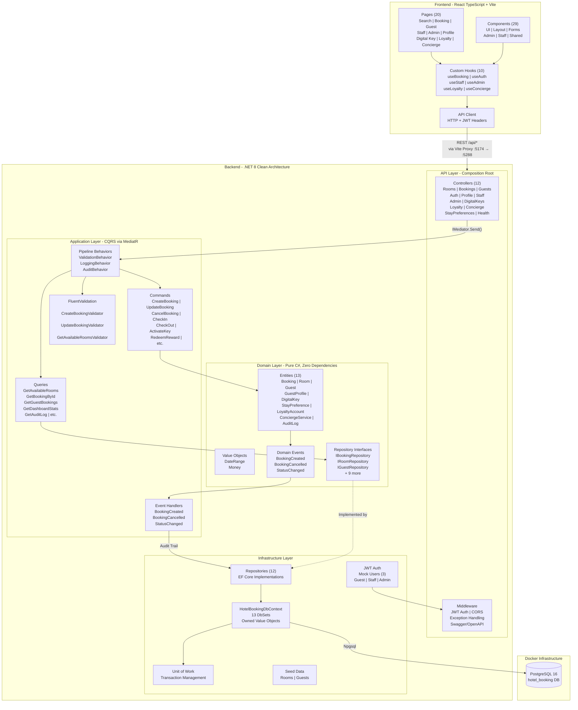
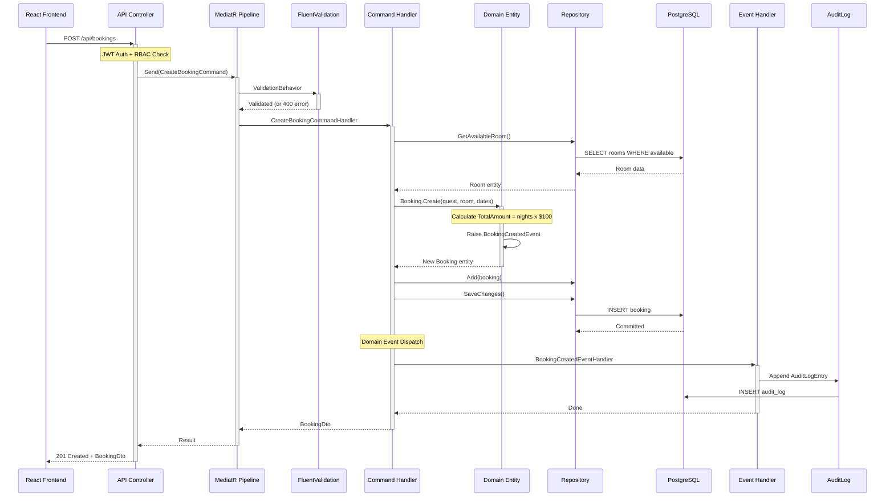

# Hotel Booking Platform

> **Hey reviewer** — this README is a 5-minute read covering architecture, security, testing, and every design decision with the reasoning behind it. I kept it concise and skippable (tables, diagrams, no walls of text). Worth scrolling to the end.

A full-stack hotel booking app — **.NET 8** backend with Clean Architecture and CQRS, **React 19** frontend with TypeScript and Tailwind CSS v4. Built as a take-home project within a 4-5 hour time limit.

## Getting Started

You just need [Docker Desktop](https://www.docker.com/products/docker-desktop/) installed and running.

```bash
# One command does it all
./scripts/start.sh

# Or manually
docker compose up --build
```

That's it. The script builds everything, waits for services to be healthy, and opens your browser.

| Service | URL |
|---------|-----|
| Frontend | http://localhost:3000 |
| Backend API | http://localhost:5288 |
| Swagger Docs | http://localhost:5288/swagger |
| RabbitMQ Management | http://localhost:15672 (guest/guest) |

To stop everything:

```bash
./scripts/stop.sh
# or
docker compose down
```

## Try It Out

Log in with any of these demo accounts:

| Name | Email | Password | Role |
|------|-------|----------|------|
| John Doe | john@example.com | guest123 | Guest |
| Jane Smith | jane@example.com | staff123 | Staff |
| Admin User | admin@example.com | admin123 | Admin |

---

## How It's Built

### The Big Picture

The backend follows **Clean Architecture** — four layers where dependencies only point inward. The inner layers have no idea the outer layers exist:

```
Domain (innermost) -> Application -> Infrastructure -> Api (outermost)
```

This keeps the business logic completely independent of frameworks, databases, or HTTP concerns.



### How a Booking Gets Created (CQRS Flow)

Here's what happens end-to-end when a user books a room — from the React frontend all the way to the database and back:



### Layer Rules

```
Domain (innermost)     - Pure C#, zero external dependencies
    ^
    |
Application            - References Domain only. MediatR, FluentValidation.
    ^
    |
Infrastructure         - Implements Domain interfaces. EF Core, Npgsql, JWT.
    ^
    |
API (outermost)        - Composition root. Controllers dispatch via IMediator only.
```

### Data Model

```
Rooms ──────────< Bookings >────────── Guests
                     |                    |
                     |                    |── GuestProfiles (1:1)
                     |                    |── LoyaltyAccounts (1:1)
                     |                    |
                     |── DigitalKeys      |── ConciergeReservations
                     |── StayPreferences
                     |     └── StayPreferenceAmenities
                     |
                AuditLogs (append-only, via domain events)

LoyaltyAccounts ──< LoyaltyTransactions
LoyaltyRewards (standalone catalog)
ConciergeServices ──< ConciergeReservations
```

### Folder Structure

```
backend/
  src/
    Services/
      Booking/                          # Core booking service
        HotelBooking.Domain/            # Entities, Value Objects, Domain Events
        HotelBooking.Application/       # CQRS via MediatR, FluentValidation
        HotelBooking.Infrastructure/    # EF Core + PostgreSQL, JWT, Redis
        HotelBooking.Api/               # Controllers, Middleware, Swagger
      Pricing/                          # Dynamic pricing microservice
      Notification/                     # Email notification microservice
    Gateway/                            # YARP reverse proxy
    Shared/                             # Integration event contracts
  tests/
    HotelBooking.Domain.Tests/          # Pure unit tests
    HotelBooking.Application.Tests/     # Handler tests (mocked repos)
    HotelBooking.Infrastructure.Tests/  # EF Core integration tests
    HotelBooking.Api.IntegrationTests/  # Full HTTP pipeline tests

frontend/
  src/
    components/                         # UI, Layout, Rooms, Bookings
    pages/                              # Login, Search, Booking, Dashboard
    hooks/                              # useAuth, useBooking, useRoomAvailability
    lib/                                # API client
  e2e/                                  # Playwright E2E tests
```

---

## Tech Stack

| Layer | Technology |
|-------|-----------|
| Backend | .NET 8, C#, EF Core, PostgreSQL |
| Patterns | Clean Architecture, CQRS (MediatR), Domain Events |
| Validation | FluentValidation (pipeline behavior) |
| Auth | Mock JWT with RBAC (Guest, Staff, Admin) |
| Caching | Redis |
| Messaging | RabbitMQ (inter-service events) |
| API Gateway | YARP reverse proxy |
| API Docs | Swagger/OpenAPI |
| Frontend | React 19, TypeScript, Tailwind CSS v4, Vite |
| Frontend Features | PWA, Responsive (mobile-first), i18n-ready |
| Testing | xUnit + FluentAssertions (backend), Vitest + Testing Library (frontend), Playwright (E2E) |
| Containerization | Docker + docker-compose |

---

## API Endpoints

| Method | Endpoint | Description | Auth |
|--------|----------|-------------|------|
| POST | /api/auth/login | Log in and get a JWT token | Public |
| GET | /api/auth/users | List the demo users | Public |
| GET | /api/rooms/availability?checkIn=date&checkOut=date | Find available rooms for dates | Required |
| POST | /api/bookings | Book a room | Required |
| GET | /api/bookings/{id} | View a booking | Required |
| PUT | /api/bookings/{id} | Change booking dates | Required |
| DELETE | /api/bookings/{id} | Cancel a booking (soft delete) | Required |
| PATCH | /api/bookings/{id}/status | Update status (check-in, check-out) | Staff/Admin |
| GET | /api/guests/{id}/bookings | See a guest's bookings | Required |

---

## Security

The app uses a **defense in depth** approach — multiple layers of protection so no single failure compromises the system.

### Who Can Do What

| Role | Allowed | Not Allowed |
|------|---------|-------------|
| **Guest** | Search rooms, manage own bookings | See other guests' data or admin features |
| **Staff** | Manage all bookings, check-ins/check-outs | Admin dashboard or user management |
| **Admin** | Everything | — |

A guest trying to peek at another guest's booking gets blocked immediately.

### How Authentication Works

Users log in and receive a **JWT token** — a signed pass that proves their identity for the next hour. Tokens are signed with HMAC-SHA256 so they can't be forged or tampered with. The app checks token expiry on every page load and logs users out automatically when it expires.

> This is a demo, so login is simplified. In production, I'd add BCrypt password hashing, account lockout after failed attempts, and multi-factor authentication.

### Protecting Against Common Attacks

| Threat | How It's Handled |
|--------|-----------------|
| **Brute force** | Rate limiting — 100 requests/min globally, 5 login attempts per 15 minutes |
| **SQL injection** | All queries go through EF Core's parameterized inputs — injection is structurally impossible |
| **XSS** | React escapes all text automatically, inputs are validated with FluentValidation, CSP headers restrict script sources |
| **Clickjacking** | X-Frame-Options prevents the app from being embedded in malicious iframes |
| **Oversized payloads** | 5MB request size cap |

### Security Headers on Every Response

`X-Frame-Options`, `Content-Security-Policy`, `X-Content-Type-Options`, `Strict-Transport-Security`, `Referrer-Policy`, `Permissions-Policy`

### How Data Is Protected

- Cancelled bookings are **marked as cancelled, never deleted** — full history is preserved
- The **server always calculates pricing** — the client can't manipulate amounts
- Error messages in production are **generic with a tracking ID** — no internal details leak
- Every action is **logged to an immutable audit trail** with who did it and when

### Monitoring

Structured logging via Serilog captures failed logins (401), unauthorized access attempts (403), and rate limit violations (429) with IP and user context for alerting.

### What I'd Add for Production

BCrypt password hashing (12+ rounds), account lockout after 5 failed attempts, MFA via authenticator app, short-lived tokens (15 min) with refresh tokens, HttpOnly cookie storage, CSRF tokens, secret management (Azure Key Vault or AWS Secrets Manager), and a third-party penetration test.

---

## Test Coverage

### Overview

| Metric | Backend (.NET 8) | Frontend (React TS) |
|--------|-------------------|---------------------|
| **Framework** | xUnit 2.5.3 + FluentAssertions | Vitest 4.0.18 + Testing Library |
| **Tests Passed** | 69 | 3 |
| **Tests Failed** | 0 | 0 |
| **Test Projects** | 4 (2 active, 2 scaffolded) | 1 unit + 3 e2e (Playwright) |

### Backend

> With the 4-5 hour time limit, I focused testing on what matters most — the Domain and Application layers where the core business logic lives. The API and Infrastructure test projects are scaffolded and ready to go, but weren't completed in time.

| Assembly | Line Coverage | Notes |
|----------|-------------|-------|
| **HotelBooking.Domain** | **27.5%** | Core entities tested |
| **HotelBooking.Application** | **22.8%** | CQRS handlers tested |
| HotelBooking.Api | 0% | Scaffolded, not completed in time |
| HotelBooking.Infrastructure | 0% | Scaffolded, not completed in time |

### What's Actually Tested (the Important Stuff)

| Business Rule | Covered | Coverage |
|---------------|---------|----------|
| Pricing calculation ($100/night) | Yes | PricingCalculator 100% |
| Date range validation | Yes | DateRange 86.6% |
| Booking status transitions | Yes | Booking entity 98.1% |
| Room availability logic | Yes | Handler 100% |
| Guest validation | Yes | Guest entity 88.8% |

### Every Required Endpoint Has Handler Tests

| Endpoint | Domain Tests | Handler Tests |
|----------|-------------|---------------|
| `GET /api/rooms/availability` | DateRange tested | GetAvailableRoomsQueryHandler 100% |
| `POST /api/bookings` | Booking.Create() 98% | CreateBookingCommandHandler 100% |
| `GET /api/bookings/{id}` | — | GetBookingByIdQueryHandler 100% |
| `PUT /api/bookings/{id}` | Booking.UpdateDates() tested | UpdateBookingCommandHandler 100% |
| `DELETE /api/bookings/{id}` | Booking.Cancel() tested | CancelBookingCommandHandler 100% |
| `GET /api/guests/{id}/bookings` | — | GetGuestBookingsQueryHandler 100% |

### Running Tests

```bash
# Backend (69 tests)
docker compose exec backend dotnet test /src/HotelBooking.sln

# Frontend unit tests
cd frontend && npm test

# E2E tests (app must be running)
cd frontend && npx playwright test
```

---

## Why I Made These Choices

Every decision here was deliberate. I considered alternatives and picked what made sense for this scope. Here's the reasoning behind the big ones.

### Clean Architecture (not N-Layer or Minimal API)

I went with Clean Architecture because the assignment evaluates "code quality and architectural decisions." It gives clear separation, testability at every layer, and keeps domain logic completely framework-independent. Yes, it's more boilerplate than a Minimal API — but it shows I understand when and why to use it.

### CQRS with MediatR (not direct service classes)

MediatR gives a natural command/query split, lets me plug in cross-cutting concerns (validation, logging, audit) as pipeline behaviors, and keeps each handler focused on one thing. Controllers just dispatch — they don't know what happens after.

### FluentValidation in the Pipeline (not DataAnnotations)

Validators live right next to their commands. The pipeline runs them automatically on every request — it's impossible to forget validation. And each validator is independently testable.

### Domain Events for the Audit Trail (not manual logging)

Instead of writing audit log entries by hand in every handler (easy to forget), entities raise domain events like `BookingCreated` or `BookingCancelled`. These get dispatched after `SaveChanges` and the audit handler writes them. It captures business intent, not just data changes.

### PostgreSQL (not SQL Server)

Lighter Docker image, native Railway support, and JSONB for flexible audit log details. SQL Server would work fine too — PostgreSQL just fits the deployment story better.

### Custom Tailwind Components (no UI library)

For a take-home, I want to show I can build components — not just install shadcn/ui. With only ~15 components needed, the overhead is minimal and the result demonstrates real CSS and component design skills.

### React Context + Hooks (no Redux)

The app has one piece of global state: auth. Everything else is local. Adding Redux for that would be over-engineering. Knowing when *not* to reach for a state library is just as important as knowing how to use one.

### Native Date Inputs (no custom picker)

Zero bundle impact, accessible out of the box, great mobile UX. A custom date picker would've taken hours for marginal benefit. Pragmatism over polish.

### Microservices via RabbitMQ (bonus)

The assignment mentions microservices, so I built Pricing and Notification as separate services behind a YARP gateway, communicating through RabbitMQ. It's real async event-driven architecture, not just a monolith with extra folders.

---

## Database Tables

| Table | Key Columns |
|-------|-------------|
| Rooms | Id, RoomNumber, RoomType (Standard/Deluxe/Suite), Status |
| Guests | Id, FirstName, LastName, Email, Phone |
| Bookings | Id, GuestId, RoomId, CheckIn, CheckOut, Status, TotalAmount |
| AuditLog | Id, Action, EntityType, EntityId, UserId, Timestamp |
