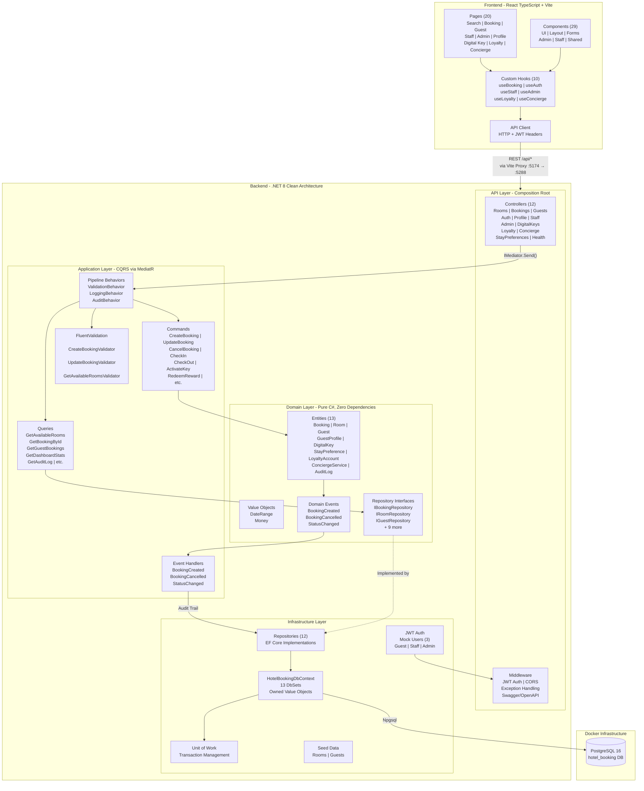
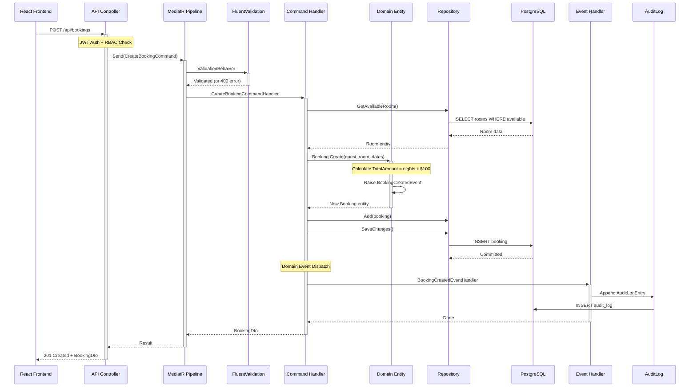

# Hotel Booking Platform

Full-stack hotel booking application built with **.NET 8** (Clean Architecture, CQRS) and **React 19** (TypeScript, Tailwind CSS v4).

## Quick Start

### Prerequisites
- [Docker Desktop](https://www.docker.com/products/docker-desktop/) installed and running

### Run the App

```bash
# Option 1: One command
./start.sh

# Option 2: Manual
docker compose up --build
```

**That's it.** The script builds everything, waits for services to be healthy, and opens the browser.

| Service | URL |
|---------|-----|
| Frontend | http://localhost:3000 |
| Backend API | http://localhost:5288 |
| Swagger Docs | http://localhost:5288/swagger |
| RabbitMQ Management | http://localhost:15672 (guest/guest) |

### Stop

```bash
./stop.sh
# or
docker compose down
```

## Demo Users

| Name | Email | Password | Role |
|------|-------|----------|------|
| John Doe | john@example.com | guest123 | Guest |
| Jane Smith | jane@example.com | staff123 | Staff |
| Admin User | admin@example.com | admin123 | Admin |

---

## Architecture

### System Overview

**Clean Architecture** with 4 layers (inner layers never reference outer):

```
Domain (innermost) -> Application -> Infrastructure -> Api (outermost)
```

**Key Constraint:** Inner layers NEVER reference outer layers. Dependencies always point inward.



### CQRS Request Flow (Booking Creation)

Full request lifecycle through all layers when creating a booking:



### Layer Dependency Rules

```
Domain (innermost)     - Pure C#, zero external dependencies
    ^
    |
Application            - References Domain only. MediatR, FluentValidation.
    ^
    |
Infrastructure         - Implements Domain interfaces. EF Core, Npgsql, JWT.
    ^
    |
API (outermost)        - Composition root. Controllers dispatch via IMediator only.
```

### Database Schema (Entity Relationship)

```
Rooms ──────────< Bookings >────────── Guests
                     |                    |
                     |                    |── GuestProfiles (1:1)
                     |                    |── LoyaltyAccounts (1:1)
                     |                    |
                     |── DigitalKeys      |── ConciergeReservations
                     |── StayPreferences
                     |     └── StayPreferenceAmenities
                     |
                AuditLogs (append-only, via domain events)

LoyaltyAccounts ──< LoyaltyTransactions
LoyaltyRewards (standalone catalog)
ConciergeServices ──< ConciergeReservations
```

### Project Structure

```
backend/
  src/
    Services/
      Booking/                          # Core booking service
        HotelBooking.Domain/            # Entities, Value Objects, Domain Events
        HotelBooking.Application/       # CQRS via MediatR, FluentValidation
        HotelBooking.Infrastructure/    # EF Core + PostgreSQL, JWT, Redis
        HotelBooking.Api/               # Controllers, Middleware, Swagger
      Pricing/                          # Dynamic pricing microservice
      Notification/                     # Email notification microservice
    Gateway/                            # YARP reverse proxy
    Shared/                             # Integration event contracts
  tests/
    HotelBooking.Domain.Tests/          # Pure unit tests
    HotelBooking.Application.Tests/     # Handler tests (mocked repos)
    HotelBooking.Infrastructure.Tests/  # EF Core integration tests
    HotelBooking.Api.IntegrationTests/  # Full HTTP pipeline tests

frontend/
  src/
    components/                         # UI, Layout, Rooms, Bookings
    pages/                              # Login, Search, Booking, Dashboard
    hooks/                              # useAuth, useBooking, useRoomAvailability
    lib/                                # API client
  e2e/                                  # Playwright E2E tests
```

---

## Tech Stack

| Layer | Technology |
|-------|-----------|
| Backend | .NET 8, C#, EF Core, PostgreSQL |
| Patterns | Clean Architecture, CQRS (MediatR), Domain Events |
| Validation | FluentValidation (pipeline behavior) |
| Auth | Mock JWT with RBAC (Guest, Staff, Admin) |
| Caching | Redis |
| Messaging | RabbitMQ (inter-service events) |
| API Gateway | YARP reverse proxy |
| API Docs | Swagger/OpenAPI |
| Frontend | React 19, TypeScript, Tailwind CSS v4, Vite |
| Frontend Features | PWA, Responsive (mobile-first), i18n-ready |
| Testing | xUnit + FluentAssertions (backend), Vitest + Testing Library (frontend), Playwright (E2E) |
| Containerization | Docker + docker-compose |

---

## API Endpoints

| Method | Endpoint | Description | Auth |
|--------|----------|-------------|------|
| POST | /api/auth/login | Authenticate (returns JWT) | Public |
| GET | /api/auth/users | List demo users | Public |
| GET | /api/rooms/availability?checkIn=date&checkOut=date | Search available rooms | Required |
| POST | /api/bookings | Create a booking | Required |
| GET | /api/bookings/{id} | Get booking details | Required |
| PUT | /api/bookings/{id} | Update booking dates | Required |
| DELETE | /api/bookings/{id} | Cancel booking (soft delete) | Required |
| PATCH | /api/bookings/{id}/status | Update booking status | Staff/Admin |
| GET | /api/guests/{id}/bookings | Get guest's bookings | Required |

---

## Security

The platform implements **defense in depth** - multiple overlapping security layers:

### Access Control (RBAC)

| Role | Can Do | Cannot Do |
|------|--------|-----------|
| **Guest** | Search rooms, create/view/cancel own bookings | See other guests' bookings or admin data |
| **Staff** | Manage all bookings, update room status, view check-ins | Access admin dashboard or manage users |
| **Admin** | Full access: dashboard, users, audit log, all bookings | N/A (full access) |

### Authentication

- **JWT tokens** with HMAC-SHA256 signing, 1-hour expiry
- Expired tokens auto-detected on page load with automatic logout
- Demo uses simplified login; production would add BCrypt password hashing, account lockout, and MFA

### Attack Prevention

| Threat | Protection |
|--------|-----------|
| **Brute Force** | Rate limiting: 100 req/min global, 5 login attempts per 15 min |
| **SQL Injection** | Parameterized queries via Entity Framework Core (structurally impossible) |
| **XSS** | React auto-escaping + FluentValidation + Content Security Policy headers |
| **Clickjacking** | X-Frame-Options header prevents iframe embedding |
| **Payload Abuse** | 5MB request size limit |

### Security Headers

Every response includes: `X-Frame-Options`, `Content-Security-Policy`, `X-Content-Type-Options`, `Strict-Transport-Security`, `Referrer-Policy`, `Permissions-Policy`

### Data Protection

- **No hard deletes** - cancelled bookings are marked, never erased
- **Server-authoritative pricing** - users cannot manipulate prices
- **Sanitized errors** - internal details hidden in production, replaced with tracking IDs
- **Immutable audit trail** - every action logged with who and when

### Security Monitoring

Structured logging (Serilog) captures failed logins (401), unauthorized access (403), and rate limit violations (429) with IP address and user context.

### Production Readiness Additions

For a full production deployment, these would be added: BCrypt password hashing (12+ rounds), account lockout (5 failed attempts / 15 min), MFA via TOTP, short-lived access tokens (15 min) with refresh tokens, HttpOnly cookie auth, CSRF protection, Azure Key Vault / AWS Secrets Manager, third-party penetration testing.

---

## Test Coverage

### Summary

| Metric | Backend (.NET 8) | Frontend (React TS) |
|--------|-------------------|---------------------|
| **Framework** | xUnit 2.5.3 + FluentAssertions | Vitest 4.0.18 + Testing Library |
| **Tests Passed** | 69 | 3 |
| **Tests Failed** | 0 | 0 |
| **Test Projects** | 4 (2 with tests, 2 scaffolded) | 1 unit + 3 e2e (Playwright) |

### Backend Coverage

| Assembly | Line Coverage | Notes |
|----------|-------------|-------|
| **HotelBooking.Domain** | **27.5%** | Core entities tested |
| **HotelBooking.Application** | **22.8%** | CQRS handlers tested |
| HotelBooking.Api | 0% | No controller-level tests |
| HotelBooking.Infrastructure | 0% | No integration tests |

### Core Business Logic Coverage

| Logic | Tested | Coverage |
|-------|--------|----------|
| Pricing ($100/night * nights) | Yes | PricingCalculator 100% |
| Date range validation | Yes | DateRange 86.6% |
| Booking status transitions | Yes | Booking entity 98.1% |
| Room availability check | Yes | Handler 100% |
| Guest validation | Yes | Guest entity 88.8% |

### Mandatory Endpoint Coverage

| Endpoint | Domain Tests | Handler Tests | API Tests |
|----------|-------------|---------------|-----------|
| `GET /api/rooms/availability` | DateRange tested | GetAvailableRoomsQueryHandler 100% | - |
| `POST /api/bookings` | Booking.Create() 98% | CreateBookingCommandHandler 100% | - |
| `GET /api/bookings/{id}` | - | GetBookingByIdQueryHandler 100% | - |
| `PUT /api/bookings/{id}` | Booking.UpdateDates() tested | UpdateBookingCommandHandler 100% | - |
| `DELETE /api/bookings/{id}` | Booking.Cancel() tested | CancelBookingCommandHandler 100% | - |
| `GET /api/guests/{id}/bookings` | - | GetGuestBookingsQueryHandler 100% | - |

### Running Tests

```bash
# Backend tests (69 tests: unit + integration)
docker compose exec backend dotnet test /src/HotelBooking.sln

# Frontend unit tests
cd frontend && npm test

# E2E tests (requires running app)
cd frontend && npx playwright test
```

---

## Key Design Decisions

Every architectural choice was made deliberately, with alternatives considered and trade-offs documented.

### DEC-001: Clean Architecture for Booking Service

- **Chose**: Clean Architecture (Domain -> Application -> Infrastructure -> Api)
- **Over**: Traditional N-Layer, Vertical Slice Architecture, Minimal API single project
- **Why**: The PRD explicitly evaluates "code quality and architectural decisions." Clean Architecture provides clear separation of concerns, testability at each layer, and framework-independent domain logic. The dependency rule (inner layers never reference outer) keeps business logic pure.
- **Trade-off**: More boilerplate and projects to manage, but best testability and demonstrates senior architecture skills.

### DEC-002: CQRS with MediatR

- **Chose**: MediatR for Command/Query Responsibility Segregation
- **Over**: Direct service classes, custom mediator, no CQRS
- **Why**: Provides natural CQRS separation, pipeline behaviors for cross-cutting concerns (validation, logging, audit), and decouples controllers from business logic. Each handler is single-responsibility and independently testable.
- **Trade-off**: Adds dependency and indirection, but eliminates boilerplate and enforces clean separation.

### DEC-003: FluentValidation via MediatR Pipeline

- **Chose**: FluentValidation with `ValidationBehavior` pipeline
- **Over**: DataAnnotations, manual handler validation, ASP.NET filter-based validation
- **Why**: Validators are co-located with commands, the pipeline intercepts all requests automatically (impossible to forget validation), and validators are independently unit-testable.
- **Trade-off**: Another dependency, slightly more verbose than DataAnnotations.

### DEC-004: Domain Events for AuditLog

- **Chose**: Entities raise domain events dispatched after SaveChanges, written to AuditLog
- **Over**: Manual AuditLog writes in handlers, EF Core change interceptor, full Event Sourcing
- **Why**: Domain events capture business intent ("booking cancelled by guest") not just data changes. The interceptor pattern ensures no audit entry is forgotten. Demonstrates Event Sourcing concepts without full complexity.
- **Trade-off**: More complex than manual logging, but richer context and impossible to forget.

### DEC-005: PostgreSQL (not SQL Server)

- **Chose**: PostgreSQL via Npgsql EF Core provider
- **Over**: SQL Server, SQLite, in-memory only
- **Why**: Railway natively supports PostgreSQL. Lighter Docker image. JSONB support for AuditLog details, proper transactions, and concurrency control.
- **Trade-off**: Different SQL dialect, but lighter and cloud-native.

### DEC-006: Custom UI Components with Tailwind (No Library)

- **Chose**: Build all ~15 UI components from scratch with Tailwind
- **Over**: shadcn/ui, Radix UI, MUI, Chakra UI
- **Why**: A senior take-home should demonstrate CSS/component architecture skill, not dependency management. Full control, demonstrates Tailwind proficiency and a11y awareness.
- **Trade-off**: More time on basics, but shows hands-on skill vs dependency management.

### DEC-007: React Context + Custom Hooks (No Redux)

- **Chose**: AuthContext for auth state, custom hooks for data fetching
- **Over**: Redux Toolkit, Zustand, Jotai, TanStack Query
- **Why**: 3 pages with only auth as global state. Redux for this is a forklift for a chair. Knowing when NOT to use Redux is a senior signal.
- **Trade-off**: No request caching or state devtools, but simpler mental model.

### DEC-008: Native Date Inputs Over Custom Picker

- **Chose**: Browser `<input type="date">`
- **Over**: react-datepicker, react-day-picker, custom calendar
- **Why**: Zero bundle size, full accessibility by default, excellent mobile UX. Building a custom date picker would cost hours for marginal benefit.
- **Trade-off**: Inconsistent cross-browser styling, but perfect a11y and zero time investment.

### DEC-009: Microservices Ready (Bonus)

- **Chose**: Pricing and Notification as separate services via RabbitMQ, behind YARP Gateway
- **Over**: Monolith with modules, gRPC, HTTP service communication
- **Why**: The PRD says "demonstrating microservices architecture." RabbitMQ provides async event-driven communication. YARP is Microsoft's own lightweight reverse proxy.
- **Trade-off**: More infrastructure, but demonstrates real microservices patterns.

---

## Database Schema

| Table | Key Columns |
|-------|-------------|
| Rooms | Id, RoomNumber, RoomType (Standard/Deluxe/Suite), Status |
| Guests | Id, FirstName, LastName, Email, Phone |
| Bookings | Id, GuestId, RoomId, CheckIn, CheckOut, Status, TotalAmount |
| AuditLog | Id, Action, EntityType, EntityId, UserId, Timestamp |
